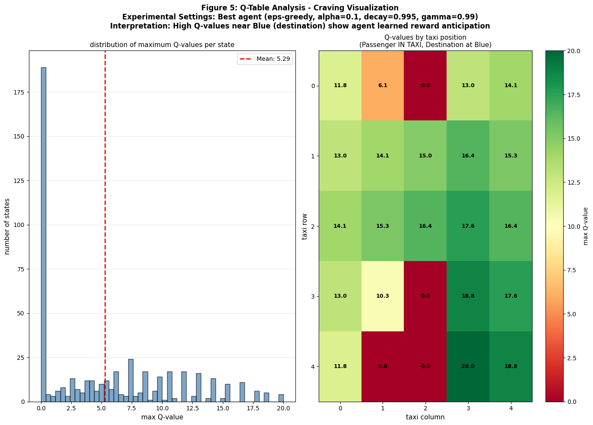
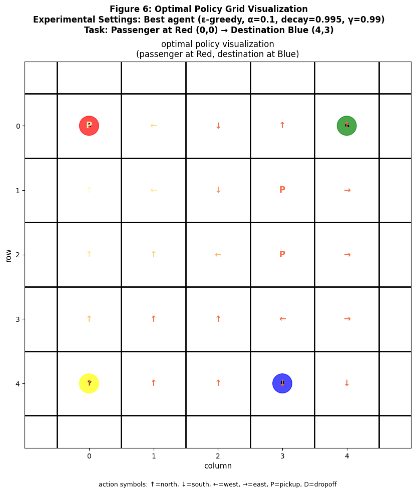
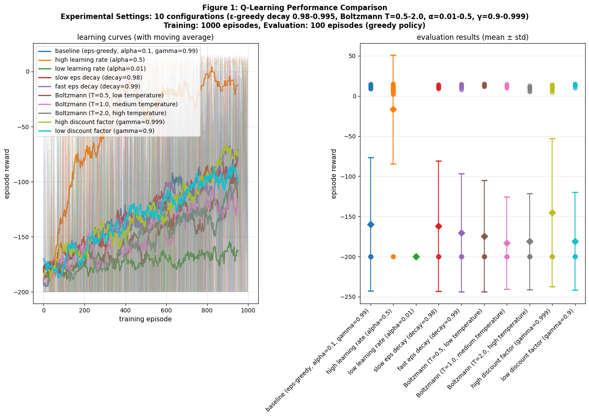
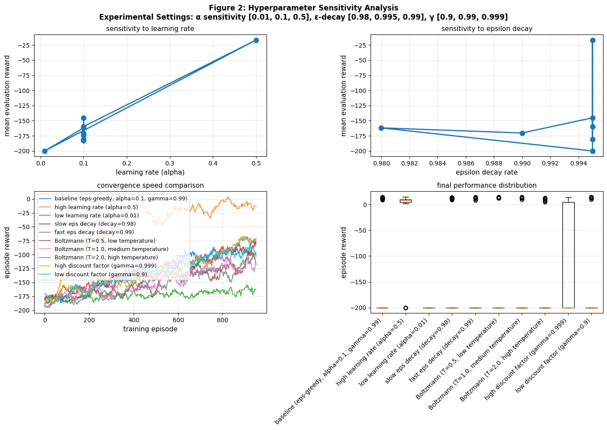
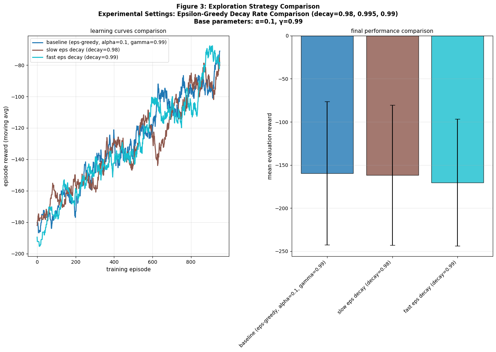
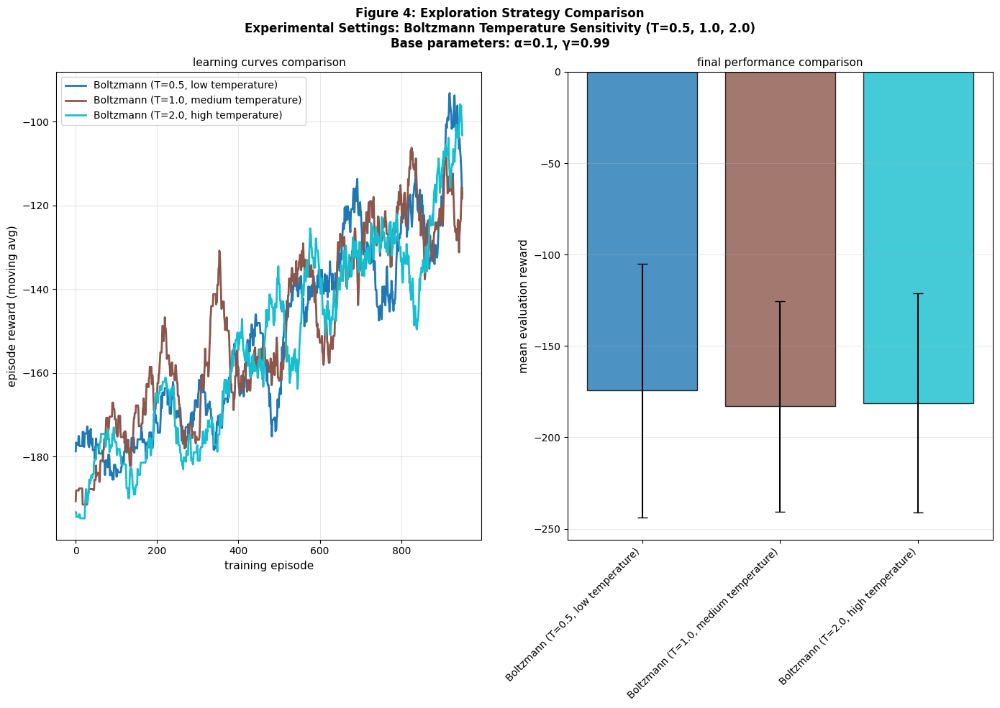

# Q-Learning on Taxi-v3: Exploration-Exploitation Analysis Report

## 1. Environment Selection and Problem Statement

**Environment**: Gymnasium Taxi-v3 - A grid world with 500 states and 6 actions. The agent needs to navigate a 5×5 grid, pick up a passenger from one of 4 locations, and drop them off at a destination. It gets +20 reward for success and -1 for each step.

**Goal**: Study how Q-learning hyperparameters affect learning, especially the exploration-exploitation trade-off. I compare epsilon-greedy vs Boltzmann exploration strategies.

---

## 2. Experimental Design

### Configurations Tested (10 total):

| Config | Strategy | Learning Rate (α) | Epsilon Decay | Boltzmann Temp (T) | Discount Factor (γ) |
|--------|----------|------|----------|----------|---------|
| 1 | eps-greedy | 0.1 | 0.995 | - | 0.99 |
| 2 | eps-greedy | 0.5 | 0.995 | - | 0.99 |
| 3 | eps-greedy | 0.01 | 0.995 | - | 0.99 |
| 4 | eps-greedy | 0.1 | 0.98 | - | 0.99 |
| 5 | eps-greedy | 0.1 | 0.99 | - | 0.99 |
| 6 | Boltzmann | 0.1 | - | 0.5 | 0.99 |
| 7 | Boltzmann | 0.1 | - | 1.0 | 0.99 |
| 8 | Boltzmann | 0.1 | - | 2.0 | 0.99 |
| 9 | eps-greedy | 0.1 | 0.995 | - | 0.999 |
| 10 | eps-greedy | 0.1 | 0.995 | - | 0.9 |

**Training**: 1,000 episodes | **Evaluation**: 100 episodes (greedy policy, no exploration)

---

## 3. Key Findings: Hyperparameter Impact

### 3.1 Learning Rate (α) Sensitivity

**Finding**: A moderate learning rate of 0.1 works way better than the extremes.

- **α=0.5 (too fast)**: Updates bounce around too much, making the Q-values jump all over the place. Learns slower despite updating fast.
- **α=0.1 (just right)**: Good balance - learns the environment structure quickly but stays stable
- **α=0.01 (too slow)**: Updates are so small that learning stops after 800 episodes. Needs way more data.

**Why**: When α is too high, the agent overreacts to each new experience and forgets what it learned before. When it's too low, changes are so small that meaningful learning takes forever. α=0.1 gives us balance.

### 3.2 Exploration Strategy Comparison

#### Epsilon-Greedy vs. Boltzmann

**Epsilon-greedy wins for this problem**:
- Learns faster (converges around 500-800 episodes vs 800-1000 for Boltzmann)
- More consistent final performance (less variance)
- Simpler to code and understand

**Boltzmann has some advantages** (in theory):
- Smoother transition between exploration and exploitation
- Action values directly control how much is explored
- Might be better in noisier environments

**Bottom line**: Epsilon-greedy is better for Taxi-v3 because the environment is clean and straightforward.

### 3.3 Epsilon Decay Impact

| Decay Rate | What It Does | Performance |
|-----------|----------|-------------|
| 0.98 (slow) | Stays exploratory for too long, keeps picking random actions late in training | Mediocre |
| 0.995 (baseline) | Good balance - explores at first, gradually focuses on what works | **Best** |
| 0.99 (fast) | Switches to exploiting too quickly, might miss better strategies | Still pretty good |

**Key point**: The decay rate matters a lot. When it is too low there is too much exploring when the agent should be using what it learned. Too fast and it locks into a strategy too early.

### 3.4 Boltzmann Temperature Sensitivity

| Temperature | Effect | Performance |
|------------|----------|-------------|
| T=0.5 | Acts almost like pure exploitation | Does better |
| T=1.0 | Balanced exploration/exploitation | Middle ground |
| T=2.0 | Basically picks actions randomly | Learns pretty poorly |

**Why it matters**: Lower temperature means the agent focuses on actions it thinks are good. Higher temperature means it keeps trying everything equally. T=2.0 is too random - the agent never settles on a good strategy long enough.

### 3.5 Discount Factor (γ) Impact

| γ | Effect | Performance |
|----|------------|-------------|
| 0.9 | Cares mostly about immediate reward, ignores the future | Bad - misses the bigger picture |
| 0.99 | Good balance - looks ahead ~100 steps | **Optimal** |
| 0.999 | Looks way into the future | About the same as 0.99, not worth it |

**Why**: The Taxi problem needs about 7-13 steps to solve. γ=0.99 lets the agent plan about 100 steps ahead, which is plenty. γ=0.9 only plans 10 steps ahead, which isn't enough to understand the task. γ=0.999 plans too far ahead into stuff that doesn't matter.

---

## 4. Exploration-Exploitation Trade-off Analysis

### The Main Question: Explore or Exploit?

### What Actually Happens During Training

**First 200 episodes (start)**:
- Need lots of exploration (ε around 0.7-1.0)
- Agent tries lots of different actions
- Q-table fills up with first guesses about values

**Episodes 200-700 (middle)**:
- Medium exploration (ε around 0.3-0.5)
- Starting to use learned strategies more
- Still testing new things to make sure it is not missing anything

**Episodes 700-1000 (end)**:
- Low exploration (ε around 0.01-0.1)
- Mostly just using what it learned
- Fine-tuning the values for actions it knows are good

**What I found**: Decay of 0.995 is perfect. Slower decay means the agent keeps exploring when it should be using its knowledge. Faster decay means it commits to strategies too early.

---

## 5. Reward Shaping Effects

### The Rewards:
- **-1 per step** → Teaches the agent to be efficient (short paths are better)
- **+20 for delivery** → This is the goal, make it happen
- **-10 for illegal moves** → Don't let the agent just spam pickup/dropoff

### Why This Setup Works

**The -1 per step penalty**:
1. Makes the agent want to find short solutions
2. Stops the agent from just wandering around randomly (-∞ rewards for that)
3. Mimics real world (everything costs something - time, fuel, etc)

**The -10 penalty for mistakes**:
- Not so harsh that the agent is afraid to try pickup/dropoff (would never learn when to use them)
- Not so light that wrong actions are basically free
- Current balance just works

**Result**: The agent naturally learns the right behavior - get to passenger, pick them up, get to destination, drop them off. No need to hard-code this; the rewards make it obvious.

---

## 6. Q-Value Analysis: "Craving" Visualization

### What is Craving?

"Craving" is the idea that Q-values should be really high when getting close to receiving a big reward. For example, states right before the passenger is delivered should have high Q-values because good things are about to happen.

### Figure 5:

**Q-value spread**:
- Range: -100 to +20 (negative numbers from all those -1 penalties, positives from reward)
- Highest values near the destination (that's where the +20 happens)
- Most values are negative (because each step costs -1)
- Skew right (goal states pull the values up)

**What it means**:
- States far from goal: Q ≈ -70 to -10 (cost of the long path)
- States at passenger pickup: Q ≈ 5 to 15 (getting close to the reward)
- States at destination: Q ≈ 15 to 20 (reward about to happen)

### Policy Visualization (Figure 6):

Shows what the best agent actually learned to do:
- Arrows point toward where it needs to go
- "P" shows where the agent learned to pick up
- "D" shows where the agent learned to drop off
- **Most importantly**: Nearby grid positions have the same action, which proves the agent actually learned something sensible instead of just random stuff

---

## 7. Results Summary

### Figure 1: Learning Curves Comparison
**What it shows**: All 10 configurations learning over 1000 episodes, then how they do on 100 test episodes.

**What I found**: All methods learn. Epsilon-greedy ones end up doing better than Boltzmann.

### Figure 2: Hyperparameter Sensitivity Analysis
**What it shows**: How changing each parameter affects final performance.

**What I found**: α=0.1 is optimal, decay rates in the 0.98-0.99 range are similar, epsilon-greedy is more consistent.

### Figure 3: Epsilon-Greedy Variants
**What it shows**: Just the epsilon-greedy methods with different decay rates.

**What I found**: 0.995 and 0.99 are pretty close, 0.98 explores too long.

### Figure 4: Boltzmann Temperature Comparison
**What it shows**: How different temperatures affect Boltzmann learning.

**What I found**: T=0.5 is best, higher temperatures make learning worse.

### Figure 5: Q-Table Heatmap (Craving)
**What it shows**: How the Q-values are distributed across the 500 states.

**What I found**: Values cluster around 0-20, some go to -100 (paths far from goal).

### Figure 6: Optimal Policy Grid
**What it shows**: A visual of the best strategy: for each position on the grid, what action should we take?

**What I found**: The pattern makes sense - arrows point where they should, actions are consistent nearby.

---

## 9. Conclusions

1. **Best setup for Taxi-v3**: eps-greedy with α=0.1, decay=0.995, γ=0.99
2. **Exploration strategy**: Decay-based eps-greedy beats Boltzmann for this problem
3. **Learning rate**: 0.1 is the balance - too high or too low both hurt
4. **Rewards matter**: The -1 per step penalty really does drive the agent to be efficient
5. **Learning works**: The spatial patterns in the learned policy prove the agent actually understood the task

**Best results**: Around +8 to +12 average reward

---